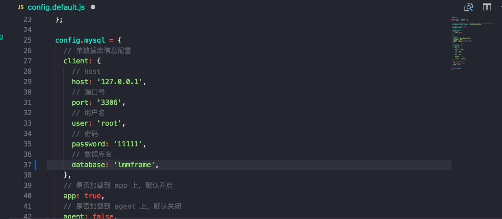
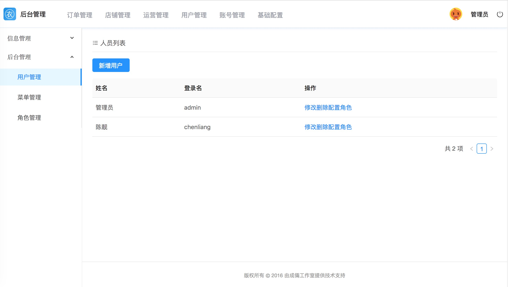

# CLReactAntDesign介绍
* CLReactAntDesign是基于[AntDesign2.0+](https://ant.design/)开发的后端页面例子，
* 整合react，react-router,react-redux，react-router-redux。进行页面状态控制
* 实用fetch进行页面请求，最终生成静态页面，实现前后端完全分离
* 附带使用koa实现的后端接口   //住server下面是koa写的接口，目前框架不使用此接口，仅供想学习koa的同学参考参考接口
* 新版本使用egg实现后端接口
 
# 开发环境
* 基于node8.0+进行开发

# 目录介绍
* backend:基于AntDesign使用的后端SPA。
* server:后端koa搭建的服务接口，主要包括，菜单管理，角色管理，用户管理，信息发布。 //目前废弃不再使用
* eggserver：后端使用egg搭建服务接口

使用前，调整mysql数据库。使用 clantd.sql修改数据库。

# 工程运行
进入到backend目录，编译运行前端框架

## 安装

安装node依赖

```
npm install

```

## 开发环境

开发使用webpack进行编译，并使用webpack.server启动一个服务器，进行页面的访问，

使用前，配置webpack.server，修改接口的转发。主要是调整端口，如果接口端口不冲突，不需要调整。


如上图，

前端转发，即今天服务器地址，默认端口port是9000，所以请求页面的默认地址是localhost:9000/index.html或localhost:9000

后端转发，为接口转发的时候，映射的地址。根据server工程设置的端口定，默认有两个，一个是请求常用接口，一个是登录验证。可视情况做相应调整

启动

```
npm run dev

```

## 生产环境

```
npm run pub

```

执行上述命令，会生成相应的文件到根目录下的pub文件夹，直接放服务器中使用即可。

生产环境，建议使用ngnix部署，直接配置静态文件目录，放目录下，使用ngnix进行接口转发。解决跨域问题。

# 后端工程启动

后端工程主要提供了一些基础的接口。使用egg来开发。利用JWT整合token机制。


## 安装

使用clantd.sql进行数据库的安装，

进入到eggserver文件夹下，

### 修改数据库配置文件

修改eggserver/config/config.default.js下的数据库配置文件



安装依赖

```
npm install

```

## 启动开发

```
npm run dev

```

## 后台部署

```
npm start //开始
npm stop //stop

```


# 展示
访问地址 localhost:9000 登录用户名密码，admin/123


